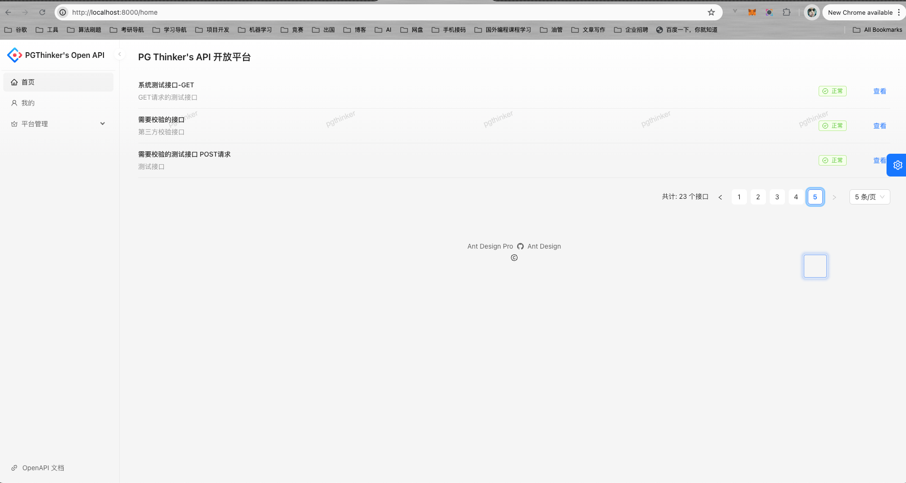
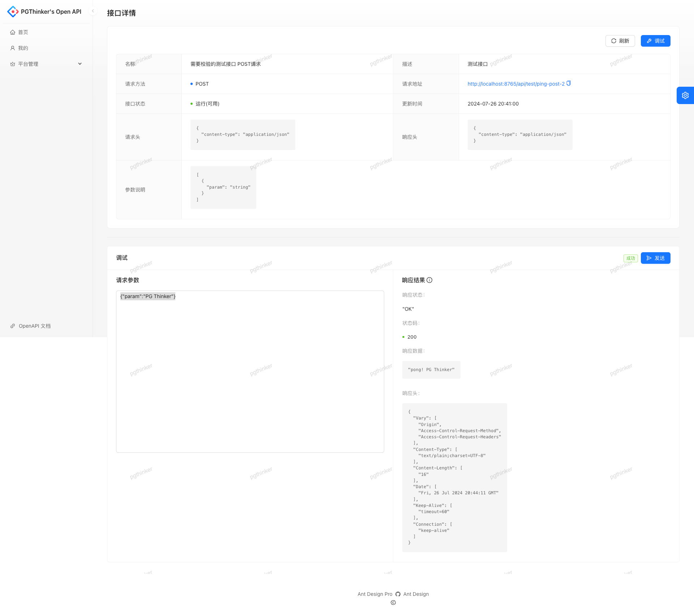
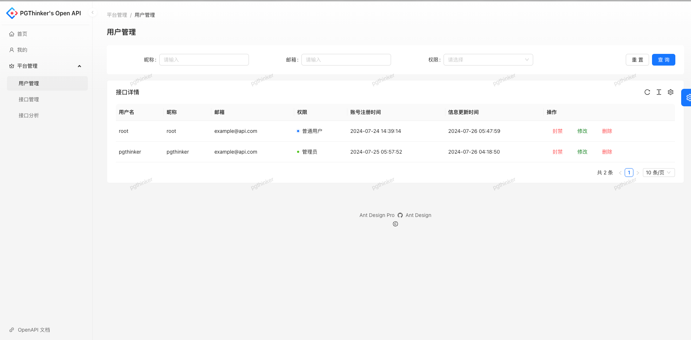
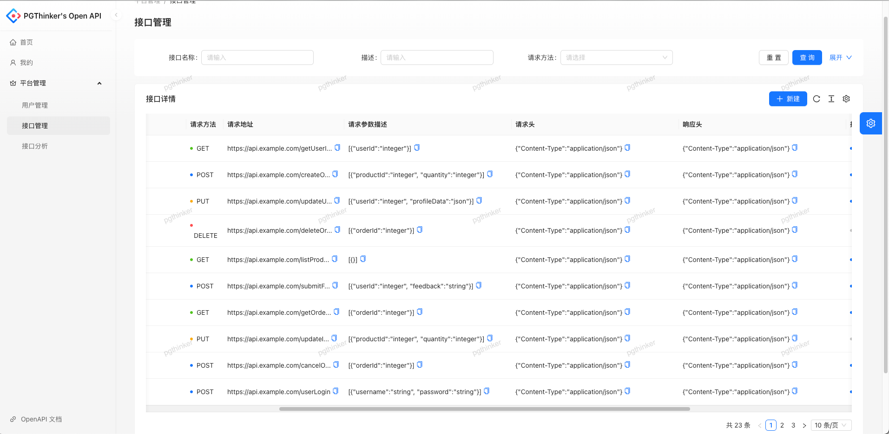

# 个人的 Open API 平台（开发中）

&emsp;我个人发布 API 接口的平台，用来管理项目开发中需要用到的接口,支持在线调试，或免费分享有趣的接口供开发人员进行测试。

## 简单的架构图


- GateWay：网关，平台的所有请求均走网关，实现统一鉴权、路由转发、业务处理、访问控制等；
- API Provider 模块：对外提供接口调用，对接第三方时，可视为中转。接口数据统计在这里实现；
- Web Platform Core 模块：网站调用的接口，如登录、数据的 CRUD、接口调用数据分析等在这里实现；
- RabbitMQ：消息队列用于将两个模块解耦，API Provider 的调用统计通过 MQ 传输;

## 技术选型

- 前端
  - React + TypeScript
  - Ant Design / Ant Design Pro
  - Umi
- 后端
  - Spring Boot

## 版本说明

- Node：v16.20.2
- JDK 8 / 17

## 本地开发说明

- 首先需要部署项目环境，本项目提供了一个[docker-compose-dev.yml](https://github.com/NingNing0111/openapi-platform/blob/master/openapi-platform-backend/platform-web-backend/env/docker-compose-dev.yml)文件，用来快速搭建项目环境。只需进入到[openapi-platform-backend/platform-web-backend/env](openapi-platform-backend/platform-web-backend/env)目录下执行下述命令：

```
docker compose -f docker-compose-dev.yml up -d
```

> 项目使用了 Nacos、Redis、MySQL。对应的环境变量可在各个`*.env`文件中修改。由于 Nacos 配置了 MySQL，如果需要修改 Nacos 的数据库，需要自行对初始化的 SQL 脚本`init.sql`进行修改。

- 后端项目模块说明：
  - `openapi-platform-web`: 核心功能，提供页面数据、内部的 Dubbo 服务;
  - `openapi-platform-provider`: 接口提供模块，这里主要实现用户调用的接口；
  - `openapi-platform-gateway`: 网关，接口统一鉴权与路由，流量染色、统一业务处理、统一访问日志；
  - `openapi-platform-common`: 公共模块 model、common、exception 等

## 效果图








