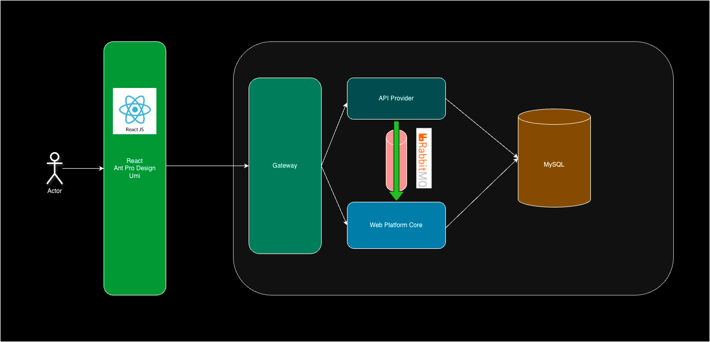

# 个人的 Open API 平台（开发中）

&emsp;我个人发布 API 接口的平台，用来管理项目开发中需要用到的接口，或免费分享有趣的接口供开发人员进行测试。

## 简单的架构图

- GateWay：网关，平台的所有请求均走网关，实现统一鉴权、路由转发、业务处理、访问控制等；
- API Provider 模块：对外提供接口调用，对接第三方时，可视为中转。接口数据统计在这里实现；
- Web Platform Core 模块：网站调用的接口，如登录、数据的 CRUD、接口调用数据分析等在这里实现；
- RabbitMQ：消息队列用于将两个模块解耦，API Provider 的调用统计通过 MQ 传输
